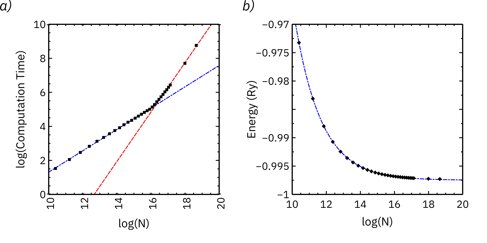
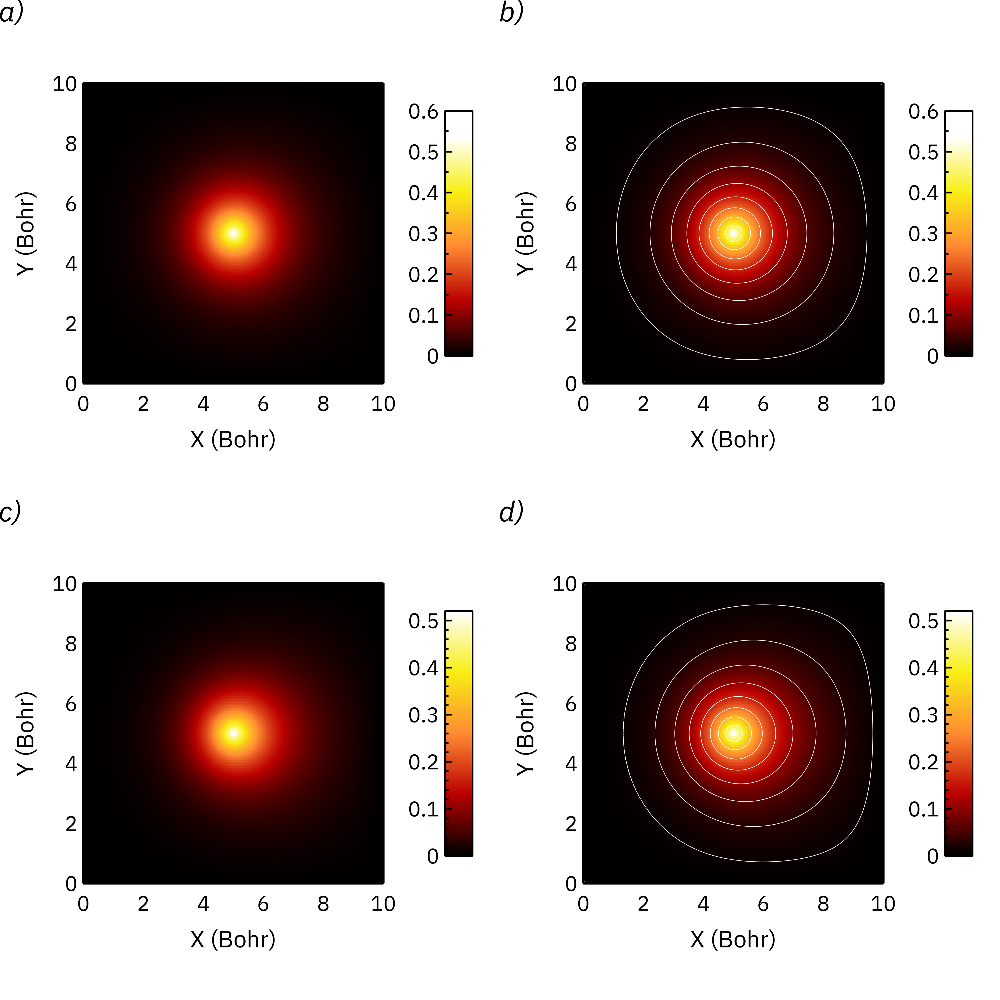

# Fixed Point Solution of Single Particle Schrödinger Equation in Finite Difference Form

Additional information and the Python code for the paper of the same title.

In this paper, I have introduced a simple fixed point map method for the numerical
solution of the Schrodinger equation in finite difference form in arbitrary dimensions.
The fixed point yields the real solutions of the single particle Schrodinger equation and
therefore, aptly suited for computing the ground state solutions of that equation.

<figure>
  
  <figcaption>Hydrogen atom in a 10 Bohr \(\times\) 10 Bohr \(times\) 10 Bohr box: a) XY plane slice of
the 3D probability amplitude for 102\(^3\) (1,061,208) grid points, b) probability amplitude
along the X direction, c) XY plane slice of the 3D probability amplitude for
302\(^3\) (27,543,608) grid points, d) probability amplitude along the X direction. The
dotted blue line shows the probability amplitude of the ground state of the free hydrogen
atom for comparison.</figcaption>
</figure>

<figure>
  
  <figcaption>Benchmarking the hydrogen atom solution in a 10 Bohr $\times$ 10 Bohr $\times$ 10 Bohr box: a) log(Computational Time) vs. log(Total Number of Voxels) shows two distinct regimes. For smaller $N$, it scales as $O(N^{0.63})$, and for larger $N$, it scales as $O(N^{1.4})$, which is a considerable improvement over the typical $O(N^3)$ behavior expected in finite difference methods, b) Plot of the ground state energy vs. log(total number of voxels). The dotted line is an exponential fit, which produces an excellent fit to the data, giving the limiting energy value of -0.997495 Ry.</figcaption>
</figure>

<figure>
  
  <figcaption></figcaption>
</figure>

<figure>
  
  <figcaption></figcaption>
</figure>

